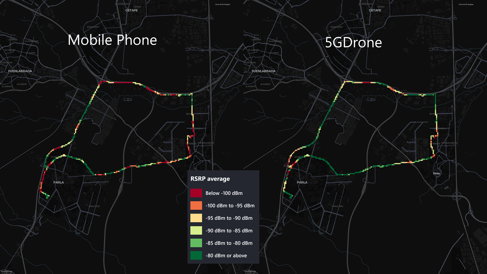

# Example of data collection

## Conditions
To verify the consistency of the datasets collected by the device, it was mounted in a vehicle alongside a Samsung Galaxy S23 Ultra phone. The phone used [G-NetTrack Lite](https://gyokovsolutions.com/g-nettrack/) to log the measured signals.

For nearly 2.5 hours, both devices recorded the received signal strength and position every second. During this time, the vehicle was driven through residential streets, conventional roads, and motorways at speeds of up to 120 km/h. The vehicle was also stationary for 1.5 hours to observe how the measurements evolved over time. Unfortunately, these measurements were not recorded correctly because the device failed to correlate the data with the GPS location.

The signal strength was measured in RSRP, as this was the only available metric for the mobile device. However, the SorusBoxScan also logged the RSRQ.

## Mapped results

The map was divided into 50x50 meter square cells. The recorded signal strengths were color-coded on the map, representing the average RSRP for each cell according to the legend.

It was observed that the SorusBoxScan device generally recorded better signal strength, likely due to its larger external antennas. However, the signal strength showed a high correlation between both devices. The correlation was not consistent across all stretches, which was expected since the devices were not always connected to the same band. The phone connected to 5G SA, while the SorusBoxScan connected to 5G NSA. Upon manual review, it was observed that the phone tended to connect to the N78 band for longer periods compared to the SorusBoxScan device.

Unfortunately, the mobile phone software did not record the band to which the phone was connected. However, this detail is available for the SorusBoxScan.

Additionally, the mobile operator's antennas in the test area can be viewed in [the Antenas Móviles website](https://www.antenasmoviles.es/?b&B1&B3&B7&B8&B20&B38&5GL&5G&5GH&ms&/#14/40.2507/-3.7220/osm).

## Results by band on the SorusBoxScan device
### b0

### b3

### b7

### b8

### b20

### n78

