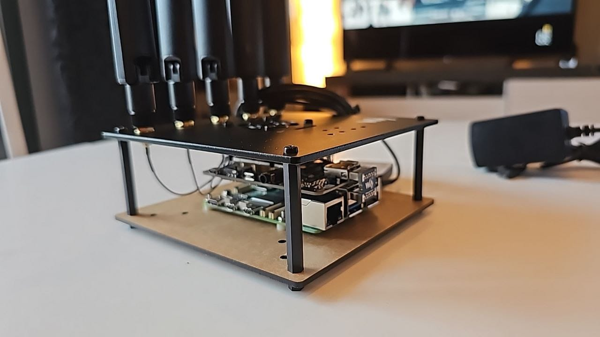
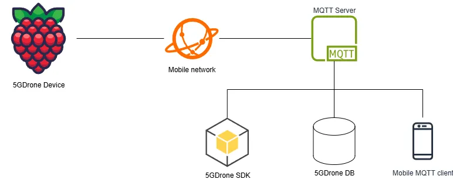

# Welcome to the 5GDrone Documentation

**5GDrone** is a device designed to measure the quality of 5G/4G/3G mobile network signals within a given area.

It can provide data in real time whenever it connects to a suitable mobile network. If no connection is available, the device caches the data locally and relays it once connectivity is restored.

The device can be mounted on a flying drone or any type of vehicle to extend its operational range.

## Hardware Description

Physically, the device is a Raspberry Pi equipped with a 5G HAT:

- [Raspberry Pi 5](https://www.raspberrypi.com/products/raspberry-pi-5/)
- [SIM8200EA-M2 5G HAT](https://www.waveshare.com/wiki/SIM8200EA-M2_5G_HAT)

## Architecture

The Raspberry Pi 5 runs a Linux-based operating system. Ubuntu is recommended due to compatibility issues with the drivers on Raspberry Pi OS (formerly known as Raspbian). Other Linux distributions may work, but have not been tested.

Once the Raspberry Pi boots (assuming the inserted SIM card does not require a PIN), it will automatically connect to the mobile network and to the MQTT server. The system will begin publishing geo-positioned signal quality measurements to the MQTT server as soon as they are available.

!!! warning
    The Raspberry Pi must be connected to a mobile network to collect signal quality data. This is not just a convenience: the hardware used only provides signal metrics when there is an active data connection to the assessed network.

If the device cannot establish or maintain a connection, it will buffer the measurements and transmit them once the connection is restored. The system is designed for signal data consumers or processors to connect to the MQTT server as clients.

## How to Exploit the Data

- **[Any MQTT client](how-to-exploit-the-data/1mqtt-client.md)** can subscribe to the signal quality messages in real time.
- **[The 5GDrone Python SDK](how-to-exploit-the-data/2sdk.md)** provides tools and libraries to help you develop applications for 5G-enabled drones.
- **[The 5GDrone Database Connector](how-to-exploit-the-data/3db.md)** stores each message sent by the Raspberry Pi in a database for future use. It is implemented using the SDK.

## About the Project

5GDrone is part of the [6G-SORUS](https://unica6g.it.uc3m.es/en/6g-sorus/) initiative, within the broader [UNICA 6G](https://unica6g.it.uc3m.es/en/) project.

UNICA 6G is an innovative project focused on the deployment of advanced 5G and 6G technologies, developed under the Spanish Recovery, Transformation and Resilience Plan.

  
  
